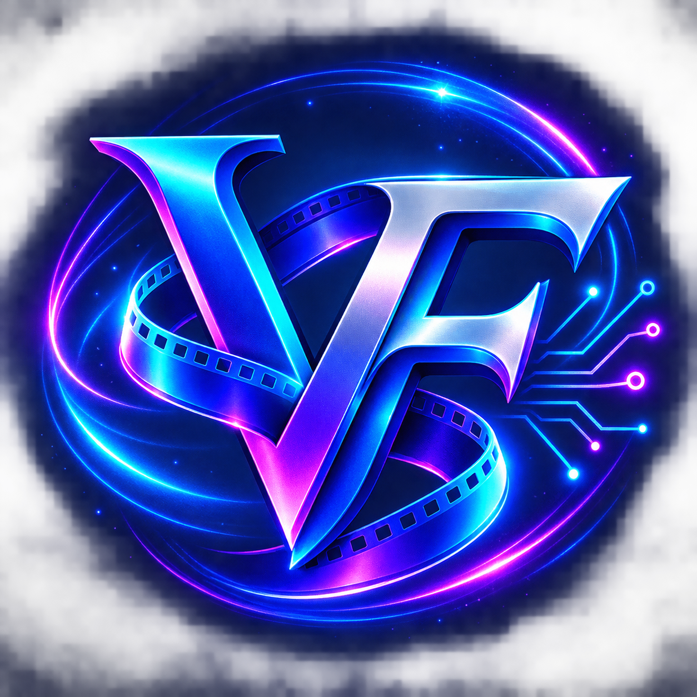
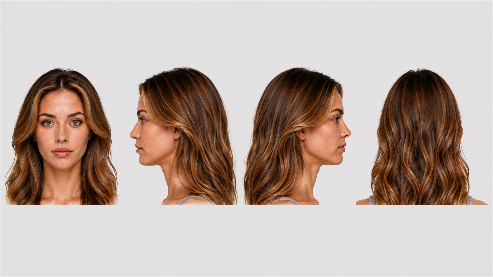
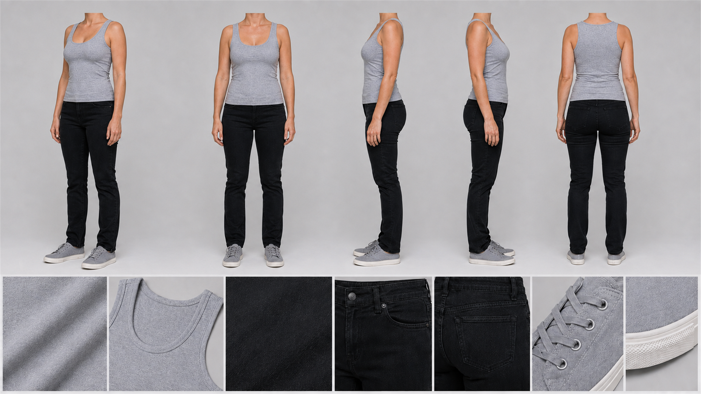
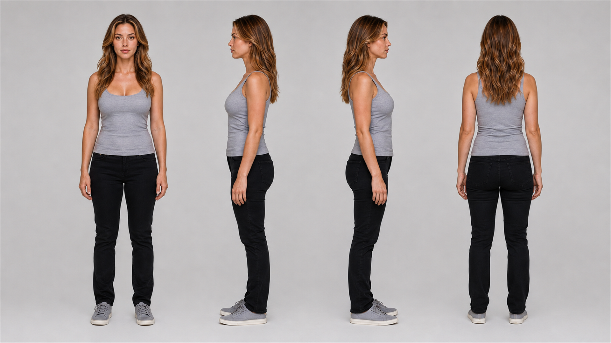
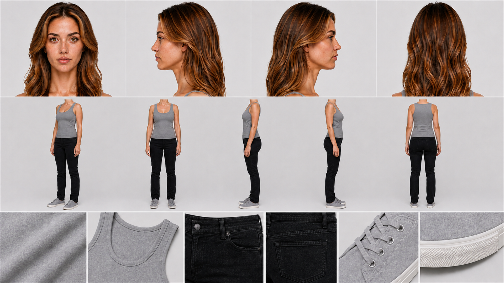
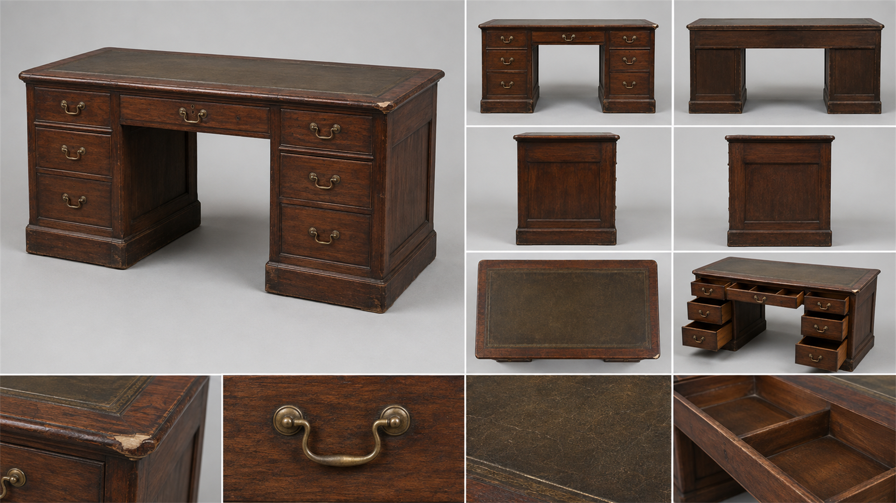
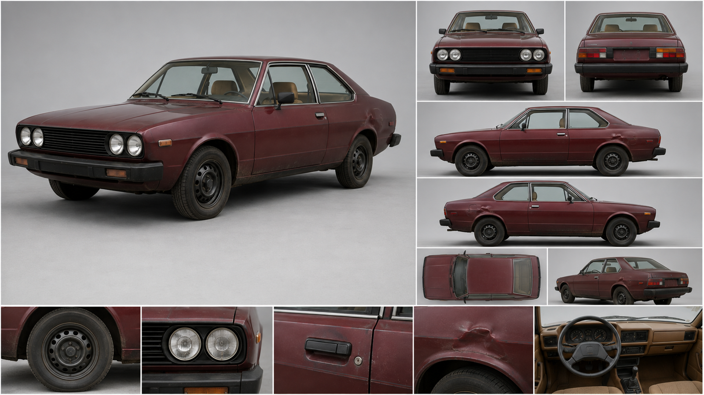

<p align="center">
  
</p>

<h1 align="center">VitaeFluxum para ChatGPT y Codex</h1>

<p align="center">
  Del guion a la imagen y al vídeo, con continuidad visual y un proceso fácil de seguir.
</p>

## ¿Qué es VitaeFluxum?

**VitaeFluxum** es un complemento gratuito con conocimientos, instrucciones y plantillas para desarrollar proyectos audiovisuales con inteligencia artificial. Ayuda a tomar decisiones profesionales sin convertir la conversación en un cuestionario técnico.

Puede trabajar desde una idea, un guion, una descripción o una o varias imágenes de referencia. Su prioridad es conservar la identidad, el vestuario, los colores, la anatomía, la lateralidad, los objetos y la continuidad entre planos.

## Qué puedes hacer

### Guion y narrativa

- Idear, desarrollar, analizar, corregir y reescribir guiones.
- Trabajar escenas, cortos, largometrajes, series, tráileres y vídeos verticales.
- Adaptar el enfoque a comedia, drama, acción, terror, thriller, ciencia ficción, fantasía, romance y otros géneros.
- Utilizar referencias cinematográficas conocidas para orientar tono, ritmo o puesta en escena sin copiar obras ni voces autorales.

### Personajes y blueprints

- Blueprint de identidad facial.
- Blueprint de cuerpo y vestuario sin cabeza, útil para fijar anatomía, piel visible, tatuajes, ropa y materiales.
- Blueprint de personaje completo.
- Ficha maestra de personaje.
- Blueprint de cualquier objeto, desde un accesorio o arma hasta un mueble, vehículo o máquina.

Los blueprints pueden crearse desde cero, con una referencia o combinando varias. Si hay una imagen para el rostro y otra para el cuerpo o el vestuario, VitaeFluxum asigna claramente la función de cada una.

Antes de crear un blueprint o una ficha técnica, preguntará si quieres:

1. solo el prompt;
2. solo la imagen;
3. el prompt y la imagen.

No generará una imagen sin que la solicites. Los ejemplos incluidos pueden mostrarse sin realizar una generación nueva.

### Del guion al vídeo

- Desglosar escenas, personajes, vestuario, objetos y localizaciones.
- Decidir qué imágenes de referencia son realmente necesarias.
- Crear una lista de planos y una biblia de continuidad.
- Crear un storyboard 3×3 cuando una escena contenga varios planos.
- Reconstruir únicamente el fotograma elegido.
- Preparar prompts profesionales de vídeo con timeline, acción, cámara, luz, interpretación y sonido.
- Revisar resultados y diagnosticar errores antes de continuar.

## Estilo y formato predeterminados

Si el usuario no indica otra cosa, VitaeFluxum utiliza **realismo cinematográfico natural** y formato horizontal **16:9 a 1920 × 1080**.

La misma estructura puede adaptarse a anime, animación 3D familiar, ilustración u otras estéticas conservando las reglas de identidad y continuidad.

## Ejemplos visuales incluidos

### Personajes

| Rostro | Cuerpo y vestuario |
|---|---|
|  |  |

| Personaje completo | Ficha maestra |
|---|---|
|  |  |

### Objetos

| Objeto pequeño | Mueble | Vehículo |
|---|---|---|
|  |  |  |

## Instalación

Necesitas una versión de ChatGPT/Codex que permita utilizar **Complementos** y **Habilidades**.

1. Abre **Configuración**.
2. Entra en **Complementos**.
3. Pulsa **Añadir → Añadir un marketplace**.
4. En **Source**, pega:

```text
https://github.com/vitaefluxum-byte/vitaefluxum-marketplace
```

5. Deja vacíos **Path** y **Branch**.
6. Pulsa **Importar marketplace**.
7. Abre **Explorar directorio**, busca `VitaeFluxum` y pulsa **Instalar**.
8. Abre un chat nuevo.

> La disponibilidad de Complementos y Habilidades puede variar según la cuenta y la versión de la aplicación.

## Primera prueba

Abre un chat nuevo y escribe:

```text
¿Qué puedes hacer con VitaeFluxum?
```

También puedes seleccionar **VitaeFluxum** entre los complementos del chat o invocarlo con `$vitaefluxum` cuando la aplicación lo permita.

## Ejemplos de uso

```text
Tengo una idea para un cortometraje. Ayúdame a convertirla en el mejor guion posible.
```

```text
Quiero un blueprint de este personaje. Enséñame primero las opciones disponibles.
```

```text
Utiliza la primera imagen para el rostro y el cabello, y la segunda para el cuerpo, la piel y el vestuario. Prepara el prompt para una ficha maestra coherente.
```

```text
Desglosa este guion y dime qué imágenes de referencia y storyboards necesitamos antes de crear los vídeos.
```

```text
Prepara un prompt de vídeo con timeline para Grok. Conserva exactamente la identidad, el vestuario, los objetos y el escenario.
```

## Control de calidad

Antes de entregar un prompt o aprobar una imagen, VitaeFluxum revisa identidad, edad, anatomía, manos, lateralidad, vestuario, colores, objetos, perspectiva, escala, iluminación, sombras, reflejos, texto accidental, logotipos y marcas de agua.

Una imagen atractiva no se considera correcta si ha cambiado un rasgo del personaje. Si aparece un error, lo identifica antes de consumir otra generación y conserva todo lo que ya funciona.

## Actualizaciones

Cuando exista una versión nueva, entra en:

**Configuración → Complementos → Tienda → VitaeFluxum Marketplace → Actualizar**

Después abre un chat nuevo para cargar los cambios. No es necesario volver a descargar ni instalar el complemento desde cero.

## Privacidad

Este complemento contiene únicamente instrucciones, referencias y ejemplos:

- no incluye servidores MCP;
- no conecta cuentas externas;
- no solicita contraseñas ni claves de API;
- no envía imágenes o documentos a servicios adicionales por sí mismo.

Las generaciones dependen de la herramienta de IA que el usuario decida utilizar y de sus propias condiciones, límites o créditos.

## Autor

Creado por **VitaeFluxum** para facilitar la creación audiovisual con inteligencia artificial de forma clara, organizada y coherente.
